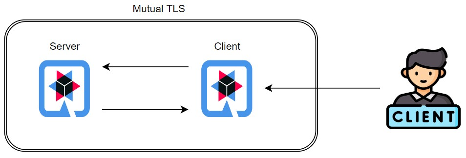

# Quarkus Mutual TLS Demo

Demonstration project that shows how to configure Transport Layer Security (TLS) on Quarkus server and Quarkus client applications.

There are two applications to this demo: [server](./server/) and [client](./client/).

First, I explain the concepts of `https`, `tls` and `mutual tls`. 

Then, I execute a few tests showing step by step how we configure and what are the problems that occur when we don't configure the applications properly.

### Index
- [Concepts](#concepts)
- [Certificate Generation](#certificate-generation)
- Tests:
  - [Server with certificate and client without truststore configured](#test---server-with-certificate-and-client-without-truststore-configured)
  - [Server with certificate and client with truststore configured](#test---server-with-certificate-and-client-with-truststore-configured)
  - [Server with mutual TLS and client don't inform identity](#test---server-with-mutual-tls-and-client-dont-inform-identity)
  - [Server with mutual TLS and client inform its certificate](#test---server-with-mutual-tls-and-client-inform-its-certificate)
- [Credits](#credits)




## Concepts

### HTTPS

> HTTPS stands for Hypertext Transfer Protocol Secure, which is a protocol used to establish a secure and encrypted connection between a web browser (or other client) and a web server.
> When you connect to a website using HTTPS, your browser and the server exchange cryptographic keys to establish a secure connection. This ensures that any data transmitted between the client and server is encrypted and protected from interception or tampering.[^1]

To estabilish a https connection, the server must have a server certificate. When the client access the server, it receives the server certificate and check if this certificate is valid and issued by a trusted Certificate Authority (CA).


### TLS

> Transport Layer Security (TLS) is a cryptographic protocol designed to provide communications security over a computer network. The protocol is widely used in applications such as email, instant messaging, and voice over IP, but its use in **securing HTTPS** remains the most publicly visible.[^2]

> Transport Layer Security (TLS) certificates—most commonly known as SSL, or digital certificates—are the foundation of a safe and secure internet. TLS/SSL certificates secure internet connections by encrypting data sent between your browser, the website you’re visiting, and the website server. They ensure that data is transmitted privately and without modifications, loss or theft.[^3]

**Mutual TLS** occurs when the client requires identification from the server and the server requires identification from the client as well.


## Certificate generation

Let's generate the server and clients certificates.

Then we will create a single keystore containing all client certificates.

The files are already on the project, if you wan't to execute the `keytool` commands, first delete the files.

Execute the following commands on the [root folder of the project](./).

### Server Certificate 
```
$ keytool -genkeypair -storepass server-password -keyalg RSA -keysize 2048 -dname "CN=server" -alias server -ext "SAN:c=DNS:localhost,IP:127.0.0.1" -validity 365000 -keystore server/server-keystore.jks
```

### Client "A" Certificate 
```
$ keytool -genkeypair -storepass client-a-password -keyalg RSA -keysize 2048 -dname "CN=client" -alias client -ext "SAN:c=DNS:localhost,IP:127.0.0.1" -validity 365000 -keystore client/client-a-keystore.jks
```

### Client "B" Certificate 
```
$ keytool -genkeypair -storepass client-b-password -keyalg RSA -keysize 2048 -dname "CN=client" -alias client-b -ext "SAN:c=DNS:localhost,IP:127.0.0.1" -validity 365000 -keystore client/client-b-keystore.jks
```

### Create the server truststore

Create the server truststore file containing all the client keystores.

Generating a server truststore file:
```
$ keytool -genkeypair -storepass authorized-clients-password -keyalg RSA -keysize 2048 -dname "CN=client" -alias authorized-clients -ext "SAN:c=DNS:localhost,IP:127.0.0.1" -validity 365000 -keystore server/server-truststore-clients.jks
```

Adding keystore from client "A" to server truststore:
```shell
$ keytool -importkeystore -srckeystore client/client-a-keystore.jks -srcstorepass client-a-password -destkeystore server/server-truststore-clients.jks -deststorepass authorized-clients-password
```

Adding keystore from client "B" to server truststore:
```shell
$ keytool -importkeystore -srckeystore client/client-b-keystore.jks -srcstorepass client-b-password -destkeystore server/server-truststore-clients.jks -deststorepass authorized-clients-password
```

### Create the client truststore

```
$ cp server/server-keystore.jks client/client-truststore.jks
```


## Test - Server with certificate and client without truststore configured

In this cenario, the server only accepts https connections, but the server certificate isn't present in the client trustore Certificate Authorite control.

Enabling TLS on the server side:
```properties
# Disallowing http access
quarkus.http.insecure-requests=disabled

# Configure https port
quarkus.http.ssl-port=8445

# Server Certificate
quarkus.http.ssl.certificate.key-store-file=./server-keystore.jks
quarkus.http.ssl.certificate.key-store-password=server-password
```

Start server:
- Enter the [server folder](./server/)
- Execute `$ ./mvnw quarkus:dev`


### Test from Quarkus Client

Start client:
- Enter the [client folder](./client/)
- Execute `$ ./mvnw quarkus:dev`

Execute client endpoint that consumes server endpoint:
```
$ curl localhost:8080/hello
```

Try to access this endpoint from the client without the Trust Store configuration, we receive this error:
```
jakarta.ws.rs.ProcessingException: javax.net.ssl.SSLHandshakeException: Failed to create SSL connection
...
Caused by: javax.net.ssl.SSLHandshakeException: Failed to create SSL connection
        at io.vertx.core.net.impl.ChannelProvider$1.userEventTriggered(ChannelProvider.java:127)
        ... 25 more
Caused by: javax.net.ssl.SSLHandshakeException: PKIX path building failed: sun.security.provider.certpath.SunCertPathBuilderException: unable to find valid certification path to requested target
...
Caused by: sun.security.validator.ValidatorException: PKIX path building failed: sun.security.provider.certpath.SunCertPathBuilderException: unable to find valid certification path to requested target
...
Caused by: sun.security.provider.certpath.SunCertPathBuilderException: unable to find valid certification path to requested target
```

### Test from curl
```
$ curl https://localhost:8445
curl: (60) SSL certificate problem: self-signed certificate
More details here: https://curl.se/docs/sslcerts.html

curl failed to verify the legitimacy of the server and therefore could not
establish a secure connection to it. To learn more about this situation and
how to fix it, please visit the web page mentioned above.
```

### Test from curl allowing insecure server connections
```
$ curl -k https://localhost:8445/hello

Hello from server
```


## Test - Server with certificate and client with truststore configured

Configure client truststore:
```properties
# Rest client specific Trust Store
quarkus.rest-client.server-api.trust-store=./client-truststore.jks
quarkus.rest-client.server-api.trust-store-password=server-password
```

### Test from Quarkus Client

Start client:
- Enter the [client folder](./client/)
- Execute `$ ./mvnw quarkus:dev`

Execute client endpoint that consumes server endpoint:
```
$ curl localhost:8080/hello

Hello from server
```

## Test - Server with mutual TLS and client don't inform identity

Include requiring of client identification (`quarkus.http.ssl.client-auth`) and the truststore of the server, that are the identities that the server will trust:
```properties
# Disallowing http access
quarkus.http.insecure-requests=disabled

# Configure https port
quarkus.http.ssl-port=8445

# Server Certificate
quarkus.http.ssl.certificate.key-store-file=./server-keystore.jks
quarkus.http.ssl.certificate.key-store-password=server-password

# Require client identification
quarkus.http.ssl.client-auth=required
quarkus.http.ssl.certificate.trust-store-file=./server-truststore-clients.jks
quarkus.http.ssl.certificate.trust-store-password=authorized-clients-password
```

Start server:
- Enter the [server folder](./server/)
- Execute `$ ./mvnw quarkus:dev`

### Test from Quarkus Client

Start client:
- Enter the [client folder](./client/)
- Execute `$ ./mvnw quarkus:dev`

Execute client endpoint that consumes server endpoint:
```
$ curl localhost:8080/hello

io.netty.handler.codec.DecoderException: javax.net.ssl.SSLHandshakeException: Received fatal alert: bad_certificate
...
Caused by: javax.net.ssl.SSLHandshakeException: Received fatal alert: bad_certificate
```

### Test from curl
```
$ curl -k https://localhost:8445

curl: (56) OpenSSL SSL_read: error:0A000412:SSL routines::sslv3 alert bad certificate, errno 0
```

## Test - Server with mutual TLS and client inform its certificate

Add the client certificate:
```properties
# Rest client specific Trust Store
quarkus.rest-client.server-api.trust-store=./client-truststore.jks
quarkus.rest-client.server-api.trust-store-password=server-password

# Rest Client specific Key Store
quarkus.rest-client.server-api.key-store=./client-a-keystore.jks
quarkus.rest-client.server-api.key-store-password=client-a-password
```

Start client:
- Enter the [client folder](./client/)
- Execute `$ ./mvnw quarkus:dev`

Execute client endpoint that consumes server endpoint:
```
$ curl localhost:8080/hello

Hello from server
```

You can add any of the client keystores that are on the truststore of the server, that are `client-a-keystore.jks (client-a-password)` or `client-b-keystore.jks (client-b-password)`.


## Credits

https://quarkus.io/guides/security-authentication-mechanisms-concept#mutual-tls

https://quarkus.io/blog/quarkus-mutual-tls/

https://quarkus.io/guides/http-reference


[^1]: https://chat.openai.com/

[^2]: https://en.wikipedia.org/wiki/Transport_Layer_Security

[^3]: https://www.digicert.com/tls-ssl/tls-ssl-certificates#:~:text=Transport%20Layer%20Security%20(TLS)%20certificates,visiting%2C%20and%20the%20website%20server.
